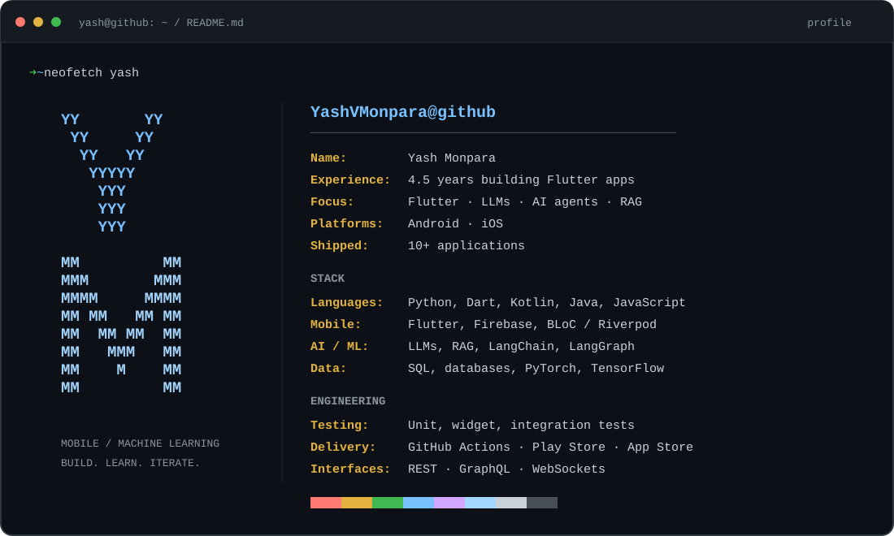
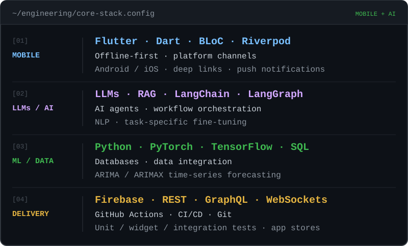

  

**4.5 years building Flutter apps · 10+ applications shipped.**  
**LLMs · AI agents · RAG · APIs · databases.**

## Technical skills

  

View the full technical stack

| Area | Technologies & practices |
| :--- | :--- |
| Mobile engineering | `Flutter` · `Dart` · `BLoC` · `Riverpod` · `Provider` · offline-first architecture · platform channels · Android / iOS |
| LLMs & agents | `LangChain` · `LangGraph` · `RAG` · LLM workflows · AI agents · NLP · task-specific fine-tuning |
| Machine learning & data | `Python` · `PyTorch` · `TensorFlow` · `SQL` · databases · `ARIMA / ARIMAX` |
| Backend & APIs | `Firebase` · `REST` · `GraphQL` · `WebSockets` · Django / Flask (non-production work) |
| Testing & delivery | `GitHub Actions` · `Git` · CI/CD · unit / widget / integration tests · Play Store / App Store |
| Additional languages & frontend | `Kotlin` · `Java` · `JavaScript` · `React` |

## Featured repositories

### [frontier-connector](https://github.com/YashVMonpara/frontier-connector)

Local AI workspace connecting Claude and OpenAI ChatGPT through DeepSeek Harness, with streaming chat, independent OAuth connections, and a Claude CLI.  
**Stack:** TypeScript · Node.js · OAuth / PKCE · SSE · DeepSeek Harness.

### [PR-risk-checker](https://github.com/YashVMonpara/PR-risk-checker)

PR review tool combining tree-sitter AST analysis, **5 deterministic rules**, and optional LLM triage. Runs as a GitHub Action or a local web app.  
**Stack:** TypeScript · Node.js · tree-sitter · GitHub Actions · OpenAI / LM Studio.

[Browse all repositories →](https://github.com/YashVMonpara?tab=repositories)
